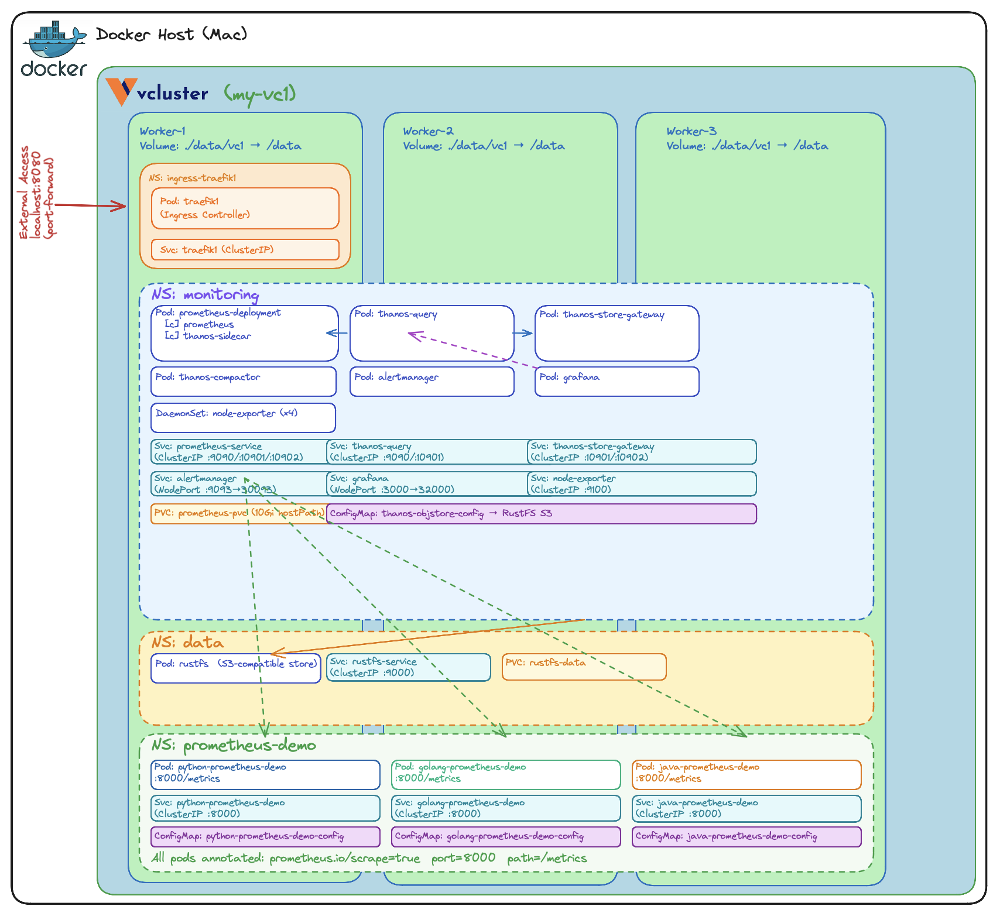

## How to: Exploring K8S on vCluster, Deploying a Observability stack - part 2

Welcome to [The Rabbit Hole](https://medium.com/@georgelza/list/the-rabbit-hole-0df8e3155e33)


When you’re building applications on Kubernetes, observability isn’t optional, it’s foundational. You need metrics to know if things are healthy, dashboards to spot trends, alerting to catch problems early, and long-term storage to answer questions about what happened last week or last month, and allot of people do this. Problem is, this is 1/2 the picture. The other 1/2 comes from logs, and mining those logs, which we call Log Analytics.

In this two-part series, we’ll deploy a complete observability stack on a local Kubernetes cluster powered by [vCluster](https://github.com/loft-sh/vcluster). No cloud account required. No VMs. Just Docker and a few commands.


- Part 1: [Prometheus](https://prometheus.io), [Grafana](https://grafana.com), [Thanos](https://thanos.io), [RustFS](https://rustfs.com), and [Traefik](https://traefik.io/traefik)

- Part 2 (this post): Adding log analytics with [ElasticSearch](https://www.elastic.co)

In our previous edition we built the monitoring stack of our environment, also commonly referred to as the metrics collection component of an Observability stack, but a Observability is the combination of metrics and log, so here we are, lets see whats involved to deploy an Log Analytics based on Elastsearch.


All source code is available at [georgelza/Exploring_vCluster_K8s_Observability_2](https://github.com/georgelza/Exploring_vCluster_K8s_Observability_2.git).

### Why vCluster for This?

[vCluster](https://github.com/loft-sh/vcluster) with the Docker driver gives you a multi-node Kubernetes cluster running entirely in Docker containers. For this project, that means a control plane and three worker nodes  enough capacity to run the full observability stack alongside demo workloads all created with a single command:

```bash
vcluster create my-vc1 -f vcluster.yaml
```

The `vcluster.yaml` configures a 3-worker-node cluster:

```yaml
controlPlane:
  distro:
    k8s:
      version: "v1.35.0"
experimental:
  docker:
    nodes:
    - name: "worker-1"
    - name: "worker-2"
    - name: "worker-3"
```

That’s it. In under a minute, you have a fully functional Kubernetes cluster with multiple nodes, ready to host real workloads. When you’re done for the day, `vcluster pause my-vc1` frees up resources. `vcluster resume my-vc1` picks up right where you left off.


## What We’re Deploying

Here’s the full stack:

### Part 2 Components -  Breakdown

```
Component                   What It Does

Elasticsearch               Elasticsearch is a distributed search and analytics engine built on Apache Lucene. Since its 
                            release in 2010, Elasticsearch has quickly become the most popular search engine and is 
                            commonly used for log analytics, full-text search, security intelligence, business analytics, 
                            and operational intelligence use cases.

Kibana                      Kibana is the open-source data visualization and exploration user interface for the 
                            Elastic Stack (Elasticsearch). It enables users to visualize data with charts, graphs, and maps, 
                            as well as manage, monitor, and secure the Elastic Stack. It is commonly used for log analysis, 
                            time-series analytics, and operational intelligence.
Filebeat                    Filebeat is a lightweight, open-source log shipper within the Elastic Stack (ELK) that 
                            monitors, collects, and forwards log files from servers to Elasticsearch or Logstash. 
                            Installed as an agent, it is designed for low resource consumption, handling 
                            high-volume, real-time data ingestion while ensuring log continuity.
```


### Previous (Part 1) Components -  Breakdown

```
Component                   What It Does

Prometheus                  Scrapes metrics from all workloads, nodes, and Kubernetes internals
Alertmanager                Handles alerts triggered by Prometheus rules
Thanos                      Provides long-term metric storage and a unified query layer across Prometheus instances
RustFS                      S3-compatible object store that backs Thanos for durable metric retention
Grafana                     Dashboards and visualization — connects to both Prometheus and Thanos as data sources
Traefik                     Ingress proxy routing all UIs through a single entry point on port 8080
```





### Three Demo Applications

As per the previous edition, the stack includes three applications that generate custom Prometheus metrics — implemented in Python, Java, and Go. 

The little surprise, what we did not mention at the time was that these example applications already exposed structured log messages as per below.

```json
{"app": "python-prometheus-demo", "module":"main", "level": "INFO", "ts": "2025-01-01T10:00:00Z", "event": "startup", "sleep_min": 1.0, "sleep_max": 5.0, "max_run": "unlimited"}
```


## The Bigger Picture

This project is part of a series building up a complete local Kubernetes development environment:

1. [Running K8s Locally with vCluster Inside Docker](https://medium.com/@georgelza/exploring-vcluster-as-solution-to-running-k8s-locally-inside-docker-6ea233c67726) — The foundation: setting up vCluster as a local dev environment

2. [Web Apps on vCluster with Traefik and Ingress](https://medium.com/@georgelza/how-to-web-apps-on-kubernetes-deployed-on-vcluster-configured-with-traefik-app-proxy-and-ingress-c79cfea7111c) — Deploying applications with proper ingress routing

3. [Observability Stack, Part 1](https://github.com/georgelza/Exploring_vCluster_K8s_Observability_1.git) — Metrics, dashboards, and long-term storage

4. Observability Stack, Part 2 (this post) — Log analytics with Elasticsearch

By the end of the series, you have a local environment with application hosting, ingress routing, metrics collection, dashboarding, alerting, long-term metric storage, and log analytics. That’s a genuinely useful development platform — and it all runs on your laptop.


## Why Log Analytics Matters

No system should go to production without end-to-end observability. You need metrics and logs working together to understand what’s happening. Log messages tell you what caused the resource usage. It's the insight into the values of the properties of the API calls, of the Database calls.


## Deploying the Stack

The deployment follows a specific order since components depend on each other:

```
namespaces → eslasticsearch → kibana → traefik → demo apps
```

Each component, as per above can be deployed using `kubectl apply -f <file name>` in the numbered directories found under `./loganalytics`. Tear down is accomplished by executing `kubectl delete -f <file name>` in the reverse order.

### Step by step

The deployment has been divided into 2 sections, Core deployment and the Log Analytics deployment.

For the complete step-by-step walkthrough, start with  `loganalytics/README.md`.

- The Core is our Generic vCluster/Kubernetes Cluster and our Traefik Application Proxy. see `loganalytics/Deploy_core.md` - Ths was already build during our previous blog, so if you have that deployed you can simply continue. 
  
- The Log Analytics deployment deploys our stack as per above onto our core Kubernetes cluster. see `loganalytics/Deploy_analytics.md`
  
See `mv-vc1/*` for screengrabs of each step executed and terminal output.


## Summary / Conclusion

.....


### vCluster Project Pages

- [vCluster](https://github.com/loft-sh/vcluster)
- [Full Quickstart Guide](https://www.vcluster.com/docs/vcluster/#deploy-vcluster)
- [Slack Server](https://slack.loft.sh/)
- [VIND, vCluster in Docker](https://github.com/loft-sh/vind)


### Supporting Background Information

- [Elasticsearch](https://www.elastic.co/)
- [Kibana](https://www.elastic.co/kibana)

- [Prometheus](https://prometheus.io)
- [Grafana](https://grafana.com)
- [Thanos](https://thanos.io)
- [RustFS](https://rustfs.com)
- [Traefik](https://traefik.io/traefik)
- [Kubernetes](https://kubernetes.io/)


## THE END

And like that we’re done with our little trip down another Rabbit Hole, Till next time. 

Thanks for following. 


### The Rabbit Hole


### ABOUT ME

I’m a techie, a technologist, always curious, love data, have for as long as I can remember always worked with data in one form or the other, Database admin, Database product lead, data platforms architect, infrastructure architect hosting databases, backing it up, optimizing performance, accessing it. Data data data… it makes the world go round.
In recent years, pivoted into a more generic Technology Architect role, capable of full stack architecture.

### By: George Leonard

- georgelza@gmail.com
- https://www.linkedin.com/in/george-leonard-945b502/
- https://medium.com/@georgelza


